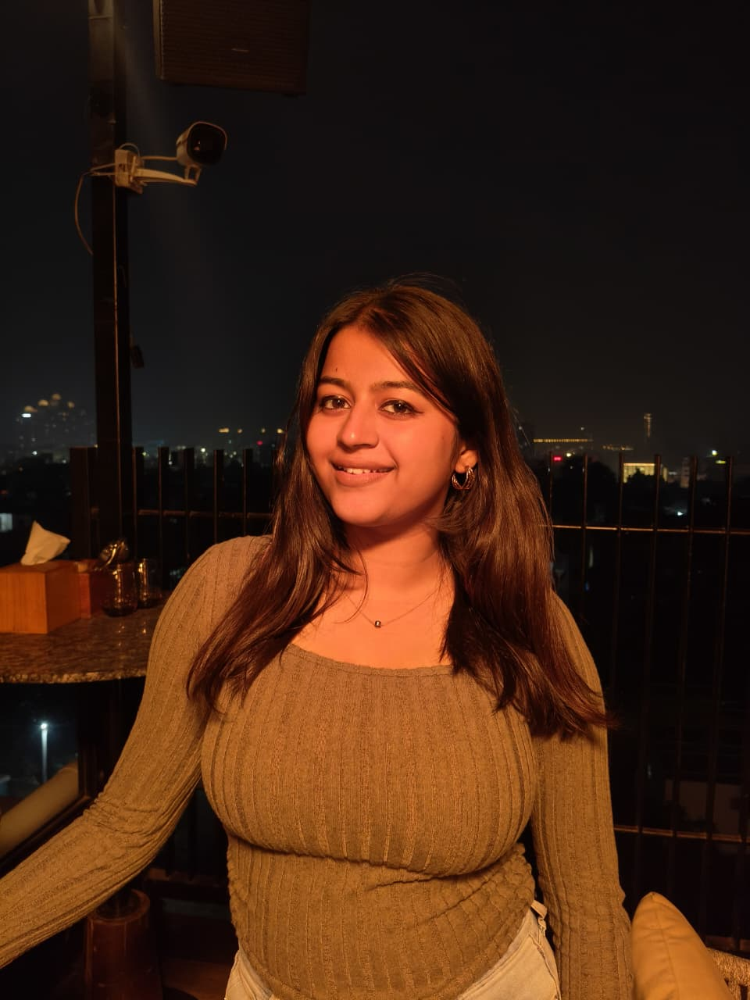

<h1 align="center">Hi, I'm Pratyaksha Singh</h1>

  

  <picture>
    <!-- Dark mode -->
    <source
      srcset="https://komarev.com/ghpvc/?username=pratyaksha0612&label=Profile%20Views&color=09193b&style=flat"
      media="(prefers-color-scheme: dark)"
    />
    <!-- Light mode -->
    <source
      srcset="https://komarev.com/ghpvc/?username=pratyaksha0612&label=Profile%20Views&color=93C5FD&style=flat&labelColor=3c5280"
      media="(prefers-color-scheme: light)"
    />
    
  </picture>

  
  
  

  

Click the image to play the introduction video.

### 👩‍💻 About

3rd-year B.Tech CSE (AI & ML) student at **VIT Bhopal University**.  
My primary interests lie in **AI/ML and computer vision**, with a focus on building **accessibility-driven systems** that translate research into real-world usability.
Experience includes **model development, web integration, and design-aware implementation**, emphasizing clarity, scalability, and thoughtful user experience.  
Originally based in **Lucknow**, currently living in **Bhopal** for academic pursuits.

📍 Lucknow / Bhopal, India  
📫 ipratyaksha.works@gmail.com | pratyaksha.23bai10345@vitbhopal.ac.in

### 🛠️ Tech Stack

**Languages & Core**  

**Web & Data**  

**Design & Workflow**  

**Version Control & DevOps**  

### 📊 GitHub Stats

  <picture>
    <!-- Dark mode -->
    <source
      srcset="https://nirzak-streak-stats.vercel.app/?user=pratyaksha0612&theme=github-dark&hide_border=true"
      media="(prefers-color-scheme: dark)"
    />
    <!-- Light mode -->
     <source
      srcset="https://nirzak-streak-stats.vercel.app/?user=pratyaksha0612&theme=github-light&hide_border=true&text_color=1F2937&sideNums=111827&sideLabels=374151"
      media="(prefers-color-scheme: light)"
    />
   
  </picture>

